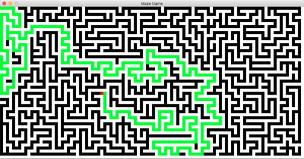

This program generates and fills a maze using a depth first aproach, showing the path it takes and returning to its starting point once every path has been travelled. Requires Pygame for drawing.

Examples
--------

    python main.py
    python main.py --width 10 --height 20
    python main.py --tile-size 5 --height 15 

Usage
-----

Press Tab to generate a new maze or click on a position in the current maze to restart solving from
that point. Use Esc or the standard window controls to exit.

The optional arguments are:

  --width WIDTH         
  	
    Width (in tiles) of the maze generated.
  
  --height HEIGHT       
  	
    Height (in tiles) of the maze generated.
  
  --tile-size TILE_SIZE
                        
    Size in pixels of one maze cell. (10 = 10 by 10
                        square)